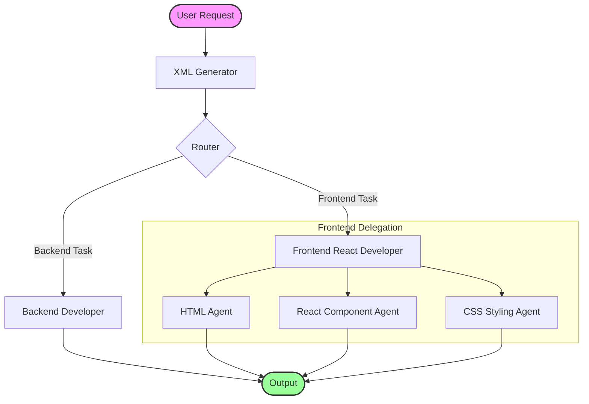

# Multi-Agent Development Pipeline

This folder contains a fully automated Claude Code multi-agent development pipeline. Each agent is a specialized system prompt that handles a specific part of the development workflow.

## 📋 Pipeline Architecture

The agents work together in a coordinated sequence to process user requests and generate code:



## 🤖 Agents

### Core Infrastructure

#### **explore-on-diet-coke**
- **Role**: Project context analyzer
- **Trigger**: Automatically runs on workspace load
- **Responsibilities**: 
  - Explores entire project directory
  - Detects project type (frontend, backend, full-stack)
  - Identifies frameworks, dependencies, and file structure
  - Generates project context XML file
  - Saves output to `/project-context/context.xml`

#### **xml-generator**
- **Role**: Request-to-specification converter
- **Trigger**: First step for every user prompt
- **Responsibilities**:
  - Converts user requests into structured XML specifications
  - Generates file-safe slugs for requests
  - Saves raw prompts for reference
  - Determines target agent for routing
  - Outputs XML only (no code generation)

#### **router**
- **Role**: Task dispatcher
- **Trigger**: After XML generation
- **Responsibilities**:
  - Routes XML specifications to appropriate agents
  - Reads `<target_agent>` field from XML
  - Never generates code or modifies XML
  - Ensures tasks reach correct specialized agent

#### **pipeline-initializer**
- **Role**: Pipeline memory and announcer
- **Trigger**: Automatically on workspace load
- **Responsibilities**:
  - Announces the multi-agent pipeline to Claude
  - Ensures consistent routing through system
  - Teaches Claude how the workflow operates
  - Does not generate code or XML

### Specialized Workers

#### **backend-developer**
- **Role**: Backend code generator
- **Trigger**: Router activates when backend work is needed
- **Responsibilities**:
  - Generates backend code based on XML specification
  - Remains inactive unless explicitly invoked by Router
  - Only responds to Router instructions
  - Does not accept direct user prompts

#### **frontend-react-developer**
- **Role**: Frontend task delegator
- **Trigger**: Router activates for frontend requests
- **Responsibilities**:
  - Interprets frontend XML specifications
  - Delegates to appropriate frontend specialist:
    - `html-frontend-agent` → HTML markup
    - `react-component-agent` → React components
    - `css-styling-agent` → CSS/styling
  - Does not generate UI code directly

#### **html-frontend-agent**
- **Role**: HTML markup generator
- **Trigger**: Router activates when HTML is needed
- **Responsibilities**:
  - Generates HTML markup based on XML spec
  - Remains inactive unless Router invokes it
  - Only responds to Router instructions

#### **react-component-agent**
- **Role**: React component generator
- **Trigger**: Router activates when React components are needed
- **Responsibilities**:
  - Generates React components based on XML spec
  - Remains inactive unless Router invokes it
  - Only responds to Router instructions

#### **css-styling-agent**
- **Role**: CSS and styling generator
- **Trigger**: Router activates when styling is needed
- **Responsibilities**:
  - Generates CSS/styling code based on XML spec
  - Respects styling frameworks specified in XML (Tailwind, Styled Components, etc.)
  - Remains inactive unless Router invokes it
  - Only responds to Router instructions

### Utility

#### **CLAUDE.md**
- **Role**: Pipeline documentation and rules
- **Purpose**: 
  - Defines mandatory automatic startup behavior
  - Establishes pipeline rules and constraints
  - Documents agent execution order
  - Ensures consistent behavior across all agents

## 🔄 Workflow

1. **Startup** → `explore-on-diet-coke` & `pipeline-initializer` run automatically
2. **User Request** → `xml-generator` converts to XML specification
3. **Routing** → `router` reads target agent and forwards
4. **Execution** → Specialized agent processes and generates output
5. **Output** → Code/content is generated and returned to user

## 📁 File Structure

```
agents/
├── README.md                      (this file)
├── CLAUDE.md                      (pipeline rules & documentation)
├── explore-on-diet-coke/          (project context analyzer)
├── pipeline-initializer/          (pipeline announcer)
├── xml-generator/                 (request converter)
├── router/                        (task dispatcher)
├── backend-developer/             (backend code generator)
├── frontend-react-developer/      (frontend delegator)
├── html-frontend-agent/           (HTML generator)
├── react-component-agent/         (React component generator)
└── css-styling-agent/             (CSS/styling generator)
```

## 🎯 Key Principles

- **No Agent Autonomy**: Specialized agents never respond to user requests directly
- **Strict Routing**: All tasks flow through the router for proper dispatch
- **Single Entry Point**: All requests go through xml-generator first
- **Separation of Concerns**: Each agent handles one specific aspect
- **Deterministic Processing**: XML format ensures consistent, reproducible results
- **Automatic Startup**: Core agents (explore, initializer) run without user confirmation

## 📦 Installation & Setup

This pipeline is platform-agnostic and works seamlessly on **macOS, Windows, and Linux**.

### Prerequisites
- [Claude Code](https://docs.anthropic.com/en/docs/agents-and-tools/claude-code/overview) installed and authenticated.

### How to Add Agents

#### Option 1: New Project
1. Clone this repository:
   ```bash
   git clone <repository-url> my-new-project
   cd my-new-project
   ```
2. Start Claude Code:
   ```bash
   claude
   ```

#### Option 2: Existing Project
1. Copy the entire `agents/` directory into your project root.
2. Ensure `CLAUDE.md` is in the root of your project (or merge its contents if you already have one).
3. Start Claude Code:
   ```bash
   claude
   ```

### Platform-Specific Notes

- **macOS / Linux**: Ensure you have permissions to run `claude` in your terminal.
- **Windows**: Run via PowerShell or Command Prompt. If using WSL, follow Linux instructions.

## 🚀 Usage

This pipeline is designed to be **completely automatic**. Simply:

1. Open Claude Code in this workspace
2. The pipeline initializes automatically
3. Make a request to Claude
4. Your request flows through the entire pipeline
5. You receive the generated output

No manual agent selection or configuration is required—the system handles everything automatically.

